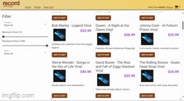

# Record Store API

## Description of the Project

A record shop that users can buy records out of. Admins can add, update, or delete items from the store. Utilized Spring Boot to create RESTful APIs to handle products, users, and store operations.

## User Stories

- As a user, I want to be able to search and get all the categories, so that I can view all the products available.
- As a user, I want to be able to search for a category by id, so that I can view products within the information I have.
- As an admin, I want to be able to create a new category, so that I can control how my products are managed.
- As an admin, I want to be able to update an existing category, so that other users can access correct information on the frontend.
- As an admin, I want to be able to delete a category, so that the users wouldn't be viewing from categories that aren't available.

## Setup

Access the website through the html file in capstone-client-recordshop.

### Prerequisites

- IntelliJ IDEA: Ensure you have IntelliJ IDEA installed, which you can download from [here](https://www.jetbrains.com/idea/download/).
- Java SDK: Make sure Java SDK is installed and configured in IntelliJ.

### Running the Application in IntelliJ

Follow these steps to get your application running within IntelliJ IDEA:

1. Open IntelliJ IDEA.
2. Select "Open" and navigate to the directory where you cloned or downloaded the project.
3. After the project opens, wait for IntelliJ to index the files and set up the project.
4. Find the main class with the `public static void main(String[] args)` method.
5. Right-click on the file and select 'Run 'YourMainClassName.main()'' to start the application.
6. In separate project, capstone-client-recordshop, and open the index.html file in Chrome and navigate the site.

## Technologies Used

- Java: Mention the version you are using.
- Any additional libraries or frameworks used in the project.

## Demo

Include screenshots or GIFs that show your application in action. Use tools like [Giphy Capture](https://giphy.com/apps/giphycapture) to record a GIF of your application.

## Future Work

Outline potential future enhancements or functionalities you might consider adding:

- Cart
- Go into the HTML and CSS
- More testing
- Enhance profile

## Resources

List resources such as tutorials, articles, or documentation that helped you during the project.

- Workshops
- Exercises
- Raymond's Website + GitHub
- Youtube

## Thanks

- Thank you to Raymond for continuous support and guidance.